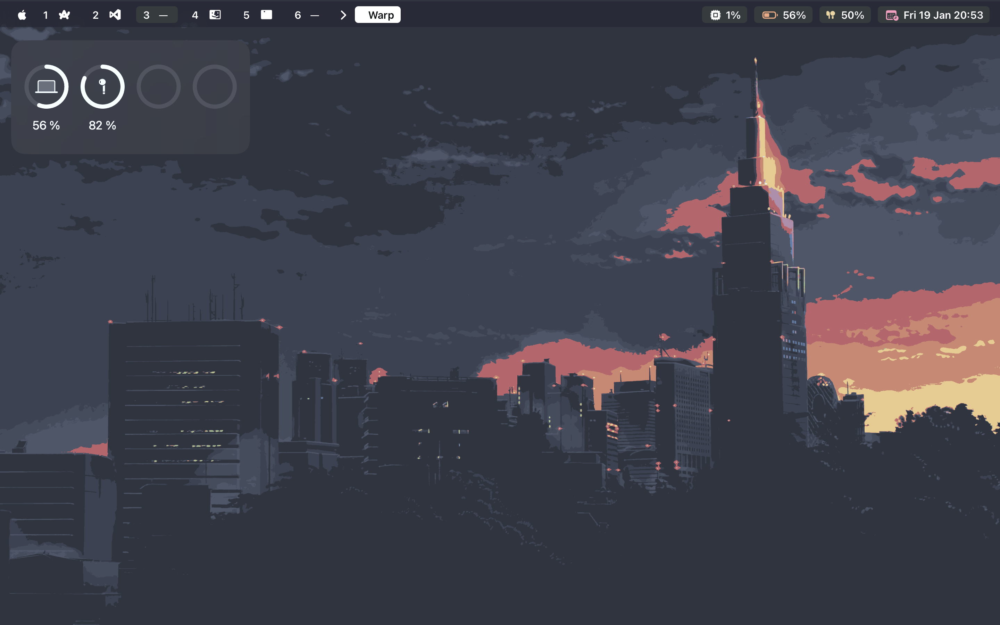
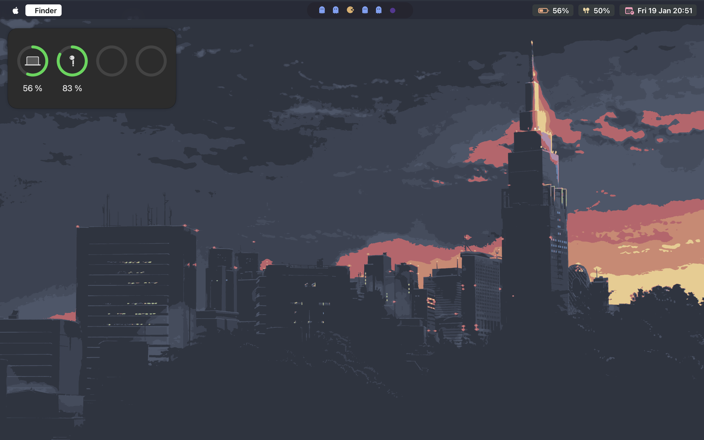

# DOTFILES

**You need install yabai and skhd**

Currently only I edit 2 themes

## My Themes

### Simple config 💻




### Pacman config 🎮




### Tools

<p>If you want install all, I recommend read the documentation of each tool before install</p>
```
brew tap FelixKratz/formulae
brew install sketchybar
brew install koekeishiya/formulae/yabai
brew install koekeishiya/formulae/skhd
brew install jq
```

# fonts

```
brew tap homebrew/cask-fonts
brew install font-ubuntu
brew install font-fontawesome
brew install font-hack-nerd-font
brew install font-fira-code-nerd-font
brew install --cask font-monocraft
```

# fonts that aren't avalible in brew (use this repo)

```
git clone https://github.com/itaysharir/Dotfiles ~/Dotfiles && cd Dotfiles
cd misc/fonts
cp Pacman-Dots.ttf ~/Library/Fonts/Pacman-Dots.ttf
```

## Credits

## Wallpapers

<p>The Wallpapers are from Hyprland, you can found here :)</p>

[Wallpapers](https://drive.google.com/drive/folders/1pVsxkVhgYRBIPEB6ldA-OEDbT0Ev-9SY?usp=sharing)

## Sketchybar

[Sketchybar](https://github.com/FelixKratz/SketchyBar)

## Yabai

[Yabai](https://github.com/koekeishiya/yabai)

## Pacman icons

[itaysharir](https://github.com/itaysharir/Dotfiles/tree/main?tab=readme-ov-file)
